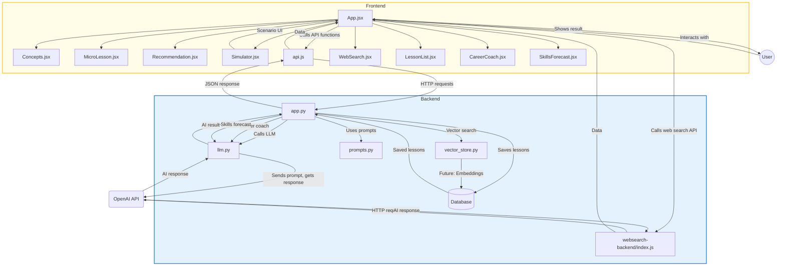

# AI Workplace Learning With AI



This project is a full-stack demo for the Nordic Software AI Hackathon. It features an AI-powered backend (FastAPI + OpenAI) and a modern React frontend for interactive workplace learning, simulation, and recommendations.

---

## Features

### Backend (FastAPI + Node.js)
- Modular API endpoints for:
  - AI Concepts generation
  - Micro-Lesson generation (with dynamic user input)
  - Scenario Simulation
  - AI Recommendation/Analysis
  - **Web Search (GPT-4.1 + tools, Node.js backend)** for up-to-date answers
  - **Saved Micro-lessons**: All generated micro-lessons are stored in a MongoDB database for later review, with endpoints for listing, editing, and deleting lessons
  - **AI Career Coach**: An intelligent mentor that guides users through soft skills, leadership scenarios, and career goals via a `/career-coach` endpoint. Supports multi-turn conversations by accepting and responding to conversation history.
  - **Dynamic Skills Forecasting**: Predicts future skill needs based on user learning history and transcript keywords via a `/skills-forecast` endpoint.
- Dynamic prompt handling with user input (e.g., custom micro-lesson topics)
- Mocked AI responses if OpenAI API key is missing or invalid
- CORS enabled for frontend-backend communication
- **MongoDB integration** for persistent storage of micro-lessons

### Frontend (React + Shoelace)
- Modular, professional UI with each feature in its own card:
  - **Concepts** (`Concepts.jsx`)
  - **Micro-lesson** (`MicroLesson.jsx`)
  - **Recommendation** (`Recommendation.jsx`)
  - **Scenario Simulator** (`Simulator.jsx`)
  - **Web Search** (`WebSearch.jsx`)
  - **Saved Micro-lessons** (`LessonList.jsx`):
    - View all previously generated micro-lessons at the bottom of the app
    - **Filter** lessons by topic in real time
    - **Expand/Compress** each lesson to show only the topic or the full content
    - **Edit** lesson topic and content inline
    - **Delete** lessons with a single click
  - **AI Career Coach** (`CareerCoach.jsx`):
    - Start a conversation with an AI mentor for career guidance, goal setting, and soft skills development
    - **Multi-turn chat interface**: Continue the conversation by sending and receiving messages in a chat-like UI
    - **End Session** button to reset the conversation and start over
    - (Future: add user context and progress tracking)
  - **Skills Forecasting** (`SkillsForecast.jsx`):
    - Enter your learning history and transcript keywords
    - Get AI-powered predictions for the next skills you should develop, with explanations
- **Shoelace-based UI:**
  - Uses [Shoelace](https://shoelace.style/) Web Components for cards, buttons, and layout in all main features (Career Coach, Skills Forecasting, Saved Micro-lessons)
  - Consistent, modern design with accessible, themeable components
  - Easy to extend with more Shoelace elements (dialogs, alerts, etc.)
- Tooltips/hints on all main options and inputs for user guidance
- Responsive, modern design with color-coded buttons
- **Per-section Clear buttons** for Concepts, Micro-lesson, and Recommendation to reset results and inputs
- Robust progress tracking and personalized dashboard
- Displays API results in a styled, readable format with proper text wrapping
- Ready for further expansion (user input for other endpoints, authentication, etc.)

---

## UI Styling: Shoelace Web Components

The app uses [Shoelace](https://shoelace.style/) for a modern, accessible, and consistent UI. Shoelace provides:
- **Cards** (`<sl-card>`) for feature panels
- **Buttons** (`<sl-button>`) for all actions (primary, secondary, danger, etc.)
- **Utility classes and layout** for spacing and alignment
- **Theme support** for easy customization

**How to customize or extend:**
- Add more Shoelace components (dialogs, alerts, inputs) as needed
- Change themes or use Shoelace’s utility classes for layout tweaks
- See [Shoelace documentation](https://shoelace.style/components/overview/) for more options

---

## Saved Micro-lessons

All micro-lessons generated by the user are automatically saved to the MongoDB database. You can view your entire history of generated micro-lessons in the **Saved Micro-lessons** section at the bottom of the app. This allows you to revisit, review, and reuse any lesson at any time.

**Features of the Saved Micro-lessons section:**
- **Filter:** Instantly filter lessons by topic as you type.
- **Expand/Compress:** Toggle each lesson to show only the topic or the full lesson content.
- **Edit:** Edit the topic and content of any lesson inline and save changes to the database.
- **Delete:** Remove any lesson from your history with a single click.
- Lessons are stored with their topic and full content.
- The list is always up to date and loads automatically.
- This feature demonstrates persistent storage, retrieval, and management in a real-world AI learning app.

---

## AI Career Coach

The **AI Career Coach** is an intelligent mentor module that guides users through soft skills, leadership scenarios, and career planning. It simulates manager-employee dialogues, helps set learning goals, and offers personalized feedback in real time.

- **How it works:**
  - The backend exposes a `/career-coach` endpoint powered by a dedicated prompt and the LLM.
  - The frontend provides a `CareerCoach.jsx` component with a chat-like interface.
  - Users can start a session, send messages, and receive contextual responses from the AI coach.
  - The conversation can be reset at any time using the **End Session** button.
- **Planned enhancements:**
  - Allow users to input their role and learning focus
  - Multi-turn conversations with state/history
  - Progress tracking and suggested resources
  - Save coaching sessions to the database

**How to use:**
- Scroll to the "AI Career Coach" section in the app
- Click "Start Coaching" to begin a session
- Type your answers and click **Send** to continue the conversation
- Click **End Session** to reset and start over

---

## Dynamic Skills Forecasting

The **Dynamic Skills Forecasting** module analyzes your learning history and transcript keywords to predict which skills you should develop next. This helps you stay ahead in your career by proactively identifying emerging skill needs.

- **How it works:**
  - The backend exposes a `/skills-forecast` endpoint powered by a dedicated prompt and the LLM.
  - The frontend provides a `SkillsForecast.jsx` component where you can enter your learning history and transcript keywords.
  - The AI suggests three future skills to develop, with reasons for each suggestion.
- **Planned enhancements:**
  - Automatically extract history and keywords from user activity and meeting transcripts
  - Save and track forecasts over time
  - Visualize skill trends

**How to use:**
- Scroll to the "Skills Forecasting" section in the app
- Enter your recent learning history and transcript keywords (or use the defaults)
- Click **Get Forecast** to receive personalized skill suggestions

---

## 4. Summary Table

| Endpoint         | Uses Web Search Tool? | Uses Standard LLM? |
|------------------|:--------------------:|:------------------:|
| `/concepts`      | ❌                   | ✅                 |
| `/micro-lesson`  | ❌                   | ✅                 |
| `/recommendation`| ❌                   | ✅                 |
| `/simulation`    | ❌                   | ✅                 |
| `/web-search`    | ✅                   | ✅ (with tool)     |

---

## Note: Two Backend Servers

This project uses **two backend servers**:

- **Python FastAPI backend** (main API):
  - Handles concepts, micro-lesson, recommendation, simulation, etc.
  - Run with:
    ```bash
    uvicorn backend.app:app --reload
    ```
- **Node.js Express backend** (web search):
  - Handles `/web-search` endpoint using OpenAI’s web search tool (if available)
  - Run with:
    ```bash
    cd websearch-backend
    node index.js
    ```

Your React frontend will call both as needed. This is a common pattern for hackathons and microservice architectures.

---

## Web Search Functionality: Tool Support and Fallback

The Web Search feature uses a separate Node.js backend to call OpenAI's GPT-4.1 model with the web search tool. **This tool is only available to some OpenAI users/organizations.**

- If your OpenAI account supports the web search tool (`web_search_preview`), you will get live, up-to-date answers from the internet.
- If not, the backend will **automatically fall back to a standard LLM response** (no web search, but still a high-quality answer).
- The user experience is seamless: you always get an answer, and no error is shown if web search is not available.

### Summary Table: Web Search Tool Support

| Tool Parameter         | Supported? | Fallback Behavior                |
|-----------------------|------------|----------------------------------|
| `web_search`          | ❌         | Falls back to standard LLM       |
| `web_search_preview`  | ❓ (beta)   | Falls back to standard LLM       |
| (no tools)            | ✅         | Standard LLM always works        |

- **Standard endpoints** (concepts, micro-lesson, recommendation, simulation) use the regular OpenAI API for fast, context-aware answers.
- **Web Search endpoint** uses GPT-4.1 with the web search tool if available, otherwise falls back to standard LLM.
- Both approaches work independently and do not interfere with each other.

---

## Tech Stack
- **Backend:** Python, FastAPI, OpenAI API, python-dotenv
- **Frontend:** React, JavaScript
- **Dev Tools:** Docker (planned), Google Cloud Run (planned)

---

## Project Structure

```
/backend/
  app.py
  prompts.py
  llm.py
  vector_store.py
/frontend/
  src/
    App.jsx
    Concepts.jsx
    MicroLesson.jsx
    Recommendation.jsx
    Simulator.jsx
    api.js
    CareerCoach.jsx
    SkillsForecast.jsx
  package.json
/deployment/
  Dockerfile
  cloudrun.yaml
README.md
```

---

## Setup Instructions

### 1. Backend
- Install dependencies:
  ```bash
  pip install fastapi uvicorn openai python-dotenv
  ```
- (Optional) Add your OpenAI API key to a `.env` file:
  ```
  OPENAI_API_KEY=sk-...
  ```
- Start the backend:
  ```bash
  uvicorn backend.app:app --reload
  ```

### 2. Frontend
- In the `frontend` folder, install dependencies:
  ```bash
  npm install
  ```
- Start the React app:
  ```bash
  npm start
  ```
- Open [http://localhost:3000](http://localhost:3000) in your browser.

---

## Usage
- Click any button to call the backend API and display the result.
- For "Micro-Lesson", enter a topic and click the button for a custom lesson.
- Use the **Clear** button in each section to reset the input and result for that feature.
- Hover over any button or input for a helpful tooltip/hint.
- Progress is tracked and shown in the dashboard at the top.
- If no valid OpenAI key is set, you will see a mocked response.

---

## Next Steps
- Make the Scenario Simulator interactive (done!)
- Add user input for other endpoints
- Add authentication/user profiles
- Deploy to the cloud (Vercel, Google Cloud Run, etc.)
- Connect to a real OpenAI key for live AI responses (done!)
- Connect to a Database(MongoDB) and save data to later session (done!)

---

**Built for the Nordic Software AI Hackathon 2025** 

---

## Automatic Tests

This project includes both unit/integration tests and end-to-end (E2E) tests for quality assurance.

### Frontend
- **Unit & Integration Tests:**
  - Written with **Jest** and **React Testing Library** (default with Create React App)
  - Test individual components and their interactions
  - To run:
    ```bash
    cd frontend
    npm test
    ```
- **End-to-End (E2E) Tests:**
  - Written with **Cypress**
  - Test full user flows (UI + backend)
  - Test files are in `frontend/cypress/e2e/`
  - To run interactively:
    ```bash
    cd frontend
    npx cypress open
    ```
  - To run headless:
    ```bash
    npx cypress run
    ```

### Backend
- **Unit & Integration Tests:**
  - Written with **pytest** and **httpx**
  - Test API endpoints and backend logic
  - Test files are in `backend/tests/`
  - To run:
    ```bash
    cd backend
    pytest
    ```

---

**See the `cypress/e2e/` folder and `src/__tests__/` for sample tests.**
If you add new features, please add or update tests to keep the project robust! 