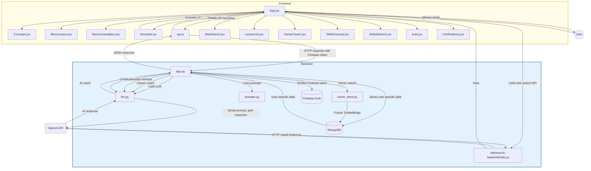

# Workplace Learning With AI



---

## 🤖 I'm not just building a learning app — I'm creating a co-evolving AI learning assistant where users shape its growth.


## Philosophy & Approach: Building with AI, Not Just Code

In this project, we intentionally chose a documentation-driven, AI-first approach to software development. Our goal was to demonstrate that, with the right architectural blueprints and explicit instructions, a modern AI system—such as Cursor AI—can build a complex, full-stack application from scratch, even in environments where pre-existing code is not allowed.

**Why this approach?**

- **Adaptability to Constraints:**  
  Many hackathons and enterprise environments restrict the use of pre-written code or external repositories. By relying on comprehensive, step-by-step documentation, we ensure that the project can be built from the ground up, regardless of these constraints.

- **AI as a True Engineering Partner:**  
  We believe that the future of software engineering is not just about writing code, but about designing processes and systems that AI can understand and execute. Our documents are written to be both human- and machine-readable, enabling seamless collaboration between developers and AI agents.

- **Transparency and Reproducibility:**  
  Every architectural decision, configuration, and troubleshooting step is documented. This makes the build process transparent, auditable, and easy to reproduce—whether by a human team or an automated system.

- **Demonstrating the Power of Modern AI:**  
  By challenging ourselves to build solely from documentation, we showcase how far AI tools like Cursor have come. This approach highlights the practical capabilities of AI in real-world, zero-code-start scenarios.

- **Onboarding and Knowledge Transfer:**  
  This methodology is not only valuable for hackathons, but also for onboarding new team members, scaling projects, and ensuring long-term maintainability. Anyone—human or AI—can pick up these documents and recreate the application with confidence.

**In summary:**  
This project is a proof of concept for the next generation of software development, where clear documentation and AI collaboration can achieve results previously possible only with direct code access. We invite you to explore, build, and extend this application—using only the instructions provided—as a testament to what’s possible with today’s AI.

---

## For Cursor AI or Automated Build Systems

**IMPORTANT:**
- This project is designed to be built by both humans and AI systems (such as Cursor AI).
- **You MUST read and follow BOTH this `README.md` and the full `Build AI Workplace Learning Application from Scratch.md` document.**
- The build document contains exhaustive, step-by-step, and troubleshooting details. This README provides a high-level overview, quick start, and essential configuration.
- Cross-reference both documents for maximum reliability and error recovery.

---

## 🟢 First Run Checklist
- [ ] MongoDB is running and accessible on localhost:27017
- [ ] Backend `.env` is configured with all required variables (see below)
- [ ] Frontend `.env` is configured with all required variables (see below)
- [ ] Firebase service account file is present in `backend/`
- [ ] All dependencies installed (`npm install` in `frontend`, `pip install -r requirements.txt` in `backend`)
- [ ] Both frontend and backend servers are running (see start commands below)
- [ ] Cypress tests pass (`npm run test:comprehensive` in `frontend`)

---

## 🔑 Environment Variables (REQUIRED)

### Backend `.env` (place in `backend/`)
```
OPENAI_API_KEY=your_openai_api_key_here
MONGO_URI=mongodb://localhost:27017
FIREBASE_CREDENTIALS=serviceAccountKey.json
```

### Frontend `.env` (place in `frontend/`)
```
REACT_APP_API_BASE_URL=http://localhost:8000
REACT_APP_FIREBASE_API_KEY=your_firebase_api_key
REACT_APP_FIREBASE_AUTH_DOMAIN=your_project.firebaseapp.com
REACT_APP_FIREBASE_PROJECT_ID=your_project_id
REACT_APP_FIREBASE_STORAGE_BUCKET=your_project.appspot.com
REACT_APP_FIREBASE_MESSAGING_SENDER_ID=your_sender_id
REACT_APP_FIREBASE_APP_ID=your_app_id
```

---

## ⚠️ Common Pitfalls & Troubleshooting

- **npm start fails with 'Missing script: start'**: Ensure you are in the `frontend` directory and `package.json` contains a `"start"` script.
- **uvicorn app:app --reload fails**: Ensure you are in the `backend` directory and `app.py` exists.
- **MongoDB connection errors**: Ensure MongoDB is running and accessible at the URI in your `.env`.
- **Firebase errors**: Ensure Google Sign-In is enabled, the web app is registered, and the service account key is present in `backend/`.
- **Cypress tests hang**: Ensure both frontend and backend servers are running. Check for port conflicts.
- **Port already in use**: Kill the process using the port or change the port in your start script.
- **Node/Python version issues**: Use Node.js 18+ and Python 3.10+ for best compatibility.
- **Component/file naming**: All references must match exactly (e.g., `Certifications.jsx`, not `Certification.jsx`).
- **CORS errors**: Ensure CORS is enabled in FastAPI and frontend is using the correct API base URL.
- **Cannot find module**: Ensure all dependencies are installed and paths are correct.

---

## 🧠 AI-Specific Guidance
- Always check for missing or misnamed files/components.
- Always check for missing or misconfigured environment variables.
- Always check for port conflicts before starting servers.
- Always check for dependency installation before running any scripts.
- Always check for correct casing in file and directory names (case-sensitive on Unix).
- Always check for correct API base URLs in both frontend and backend.
- Always check for correct Firebase configuration and credentials.
- Always check for CORS settings in backend.
- Always check for MongoDB running and accessible.
- Always check for Node.js and Python versions.

---

## Features

### Backend (FastAPI + Node.js)
- Modular API endpoints for:
  - AI Concepts generation
  - Micro-Lesson generation (with dynamic user input)
  - Scenario Simulation
  - AI Recommendation/Analysis
  - **Web Search (GPT-4.1 + tools, Node.js backend)** for up-to-date answers
  - **Saved Micro-lessons**: All generated micro-lessons are stored in a MongoDB database for later review, with endpoints for listing, editing, and deleting lessons
  - **AI Career Coach**: An intelligent mentor that guides users through soft skills, leadership scenarios, and career goals via a `/career-coach` endpoint. Supports multi-turn conversations by accepting and responding to conversation history.
  - **Dynamic Skills Forecasting**: Predicts future skill needs based on user learning history and transcript keywords via a `/skills-forecast` endpoint.
  - **AI-Powered Certifications**: Get personalized certification recommendations and study plans via `/certifications` endpoints with user-specific data persistence.
- **Firebase Authentication**: Secure user authentication with Google Sign-In
- **User-Specific Data**: All data (lessons, career sessions, forecasts, certifications) is saved per user
- Dynamic prompt handling with user input (e.g., custom micro-lesson topics)
- Mocked AI responses if OpenAI API key is missing or invalid
- CORS enabled for frontend-backend communication
- **MongoDB integration** for persistent storage of user-specific data

### Frontend (React + Shoelace)
- **Google Sign-In via Firebase Authentication** for secure, personalized access
- **Global Search Functionality** (`GlobalSearch.jsx`):
  - **🔍 Search Button**: Located in the header next to the theme toggle
  - **⌨️ Keyboard Shortcuts**: Press `Ctrl+K` (or `Cmd+K` on Mac) to open search
  - **📱 Modal Interface**: Clean, modern search overlay with real-time filtering
  - **🎯 Comprehensive Coverage**: Search across all 11 sections (Dashboard, AI Concepts, Micro-lessons, etc.)
  - **⚡ Smart Search**: Searches titles, descriptions, and keywords for instant results
  - **🎨 Theme Aware**: Adapts to light/dark mode automatically
  - **⌨️ Keyboard Navigation**: Use arrow keys to navigate results, Enter to select, Escape to close
- Modular, professional UI with each feature in its own card:
  - **Concepts** (`Concepts.jsx`)
  - **Micro-lesson** (`MicroLesson.jsx`)
  - **Recommendation** (`Recommendation.jsx`)
  - **Scenario Simulator** (`Simulator.jsx`)
  - **Web Search** (`WebSearch.jsx`)
  - **Saved Micro-lessons** (`LessonList.jsx`):
    - View all previously generated micro-lessons at the bottom of the app
    - **Filter** lessons by topic in real time
    - **Expand/Compress** each lesson to show only the topic or the full content
    - **Edit** lesson topic and content inline
    - **Delete** lessons with a single click
  - **AI Career Coach** (`CareerCoach.jsx`):
    - Start a conversation with an AI mentor for career guidance, goal setting, and soft skills development
    - **Multi-turn chat interface**: Continue the conversation by sending and receiving messages in a chat-like UI
    - **End Session** button to reset the conversation and start over
    - Sessions are automatically saved per user
  - **Skills Forecasting** (`SkillsForecast.jsx`):
    - Enter your learning history and transcript keywords
    - Get AI-powered predictions for the next skills you should develop, with explanations
    - Forecasts are saved per user for future reference
  - **Certifications** (`Certifications.jsx`):
    - **AI-Powered Recommendations**: Get personalized certification suggestions based on your role, skills, and goals
    - **Smart Skills Management**: 
      - **Individual Skill Tags**: Skills display as removable blue tags instead of plain text
      - **Comma-Separated Input**: Type multiple skills separated by commas (e.g., "Jira, Confluence, Slack")
      - **Quick Add Button**: 🧪 Quick Add button to instantly add typed skills
      - **Paste Support**: Paste multiple skills and they'll be automatically split
      - **Auto-Sync**: Skills automatically sync between "Get Recommendations" and "Study Plan" tabs
      - **Visual Feedback**: Clear indication when skills are auto-filled from saved profile
    - **Study Plan Generation**: Create personalized weekly study plans for selected certifications
    - **Practice Tests**: Interactive certification interview simulations
    - **History Tracking**: View previous study plans and recommendations
    - **Profile Persistence**: Your role, skills, and goals are automatically saved and restored
  - **🧪 Run Test** (`RunTest.jsx`):
    - **Comprehensive Testing Suite**: Built-in testing functionality accessible from the sidebar
    - **Manual Testing**: Quick verification that all panels load correctly
    - **Automated Testing**: Cypress-powered tests for all sidebar options and features
    - **Visual Results**: Real-time test results with pass/fail status and execution times
    - **Screenshot Capture**: Automatic screenshots for visual verification of each panel
    - **Test Coverage**: Tests all 11 sidebar options, global search, theme toggle, and responsive design
    - **Easy Access**: Click the test tube icon (🧪) in the sidebar to run tests
- **Shoelace-based UI:**
  - Uses [Shoelace](https://shoelace.style/) Web Components for cards, buttons, and layout in all main features (Career Coach, Skills Forecasting, Saved Micro-lessons)
  - Consistent, modern design with accessible, themeable components
  - Easy to extend with more Shoelace elements (dialogs, alerts, etc.)
- Tooltips/hints on all main options and inputs for user guidance
- Responsive, modern design with color-coded buttons
- **Per-section Clear buttons** for Concepts, Micro-lesson, and Recommendation to reset results and inputs
- Robust progress tracking and personalized dashboard
- Displays API results in a styled, readable format with proper text wrapping
- Ready for further expansion (user input for other endpoints, authentication, etc.)

---

## Recent Improvements: Enhanced Certifications Module

### **🎯 Smart Skills Management System**

The Certifications module has been significantly enhanced with a sophisticated skills management system:

#### **Individual Skill Tags**
- **Visual Display**: Skills now appear as individual blue tags with remove buttons (×)
- **Easy Removal**: Click the × on any skill tag to remove it instantly
- **Professional Look**: Clean, modern tag-based interface instead of plain text

#### **Advanced Input Methods**
- **Comma-Separated Input**: Type multiple skills at once (e.g., "Jira, Confluence, Slack")
- **Semicolon Support**: Also supports semicolon separation (e.g., "Jira; Confluence; Slack")
- **Paste Functionality**: Paste a list of skills and they'll be automatically parsed
- **Quick Add Button**: 🧪 Quick Add button to instantly add whatever you've typed

#### **Auto-Sync Between Tabs**
- **Seamless Integration**: Skills automatically sync between "Get Recommendations" and "Study Plan" tabs
- **Visual Feedback**: Clear status messages when skills are auto-filled from your saved profile
- **Persistent Storage**: Your skills are saved and restored automatically

#### **Enhanced User Experience**
- **Input Tracking**: The input field tracks what you type for the Quick Add button
- **Smart Parsing**: Automatically splits comma/semicolon-separated skills into individual tags
- **Duplicate Prevention**: Prevents adding the same skill multiple times
- **Real-time Updates**: Skills update immediately as you add or remove them

### **🔧 Technical Improvements**

#### **Fixed Compilation Issues**
- **State Management**: Added missing state variables (`studyPlanResult`, `simulation`)
- **Function References**: Fixed incorrect field references in study plan generation
- **Error Handling**: Improved error handling and validation

#### **Enhanced Testing**
- **Cypress Integration**: Comprehensive end-to-end testing for all sidebar options
- **Visual Verification**: Automatic screenshots for each panel test
- **Reliable Tests**: Fixed hanging issues and improved test stability
- **Timeout Management**: Proper timeouts to prevent test failures

### **📋 Usage Examples**

#### **Adding Skills**
1. **Type**: "Jira, Confluence, Slack" in the skills input
2. **Click**: 🧪 Quick Add button
3. **Result**: Three separate blue tags appear: "Jira", "Confluence", "Slack"

#### **Pasting Skills**
1. **Copy**: "Selenium; Cypress; Test Automation" from another source
2. **Paste**: Into the skills input field
3. **Result**: Three skills automatically split and added as tags

#### **Switching Between Tabs**
1. **Add skills** in "Get Recommendations" tab
2. **Switch** to "Study Plan" tab
3. **See**: Skills automatically appear in the "Current Skills" section

#### **Profile Persistence**
1. **Fill out** your role, skills, and goals
2. **Click**: "Get Recommendations" to save your profile
3. **Refresh** the page or return later
4. **See**: All your data is automatically restored

### **🎨 Visual Improvements**
- **Modern Tag Design**: Professional blue tags with hover effects
- **Clear Visual Hierarchy**: Better spacing and typography
- **Responsive Layout**: Works perfectly on all screen sizes
- **Theme Integration**: Adapts to light/dark mode automatically

---

## Prompt Evolution: Improving with prompts.chat

To ensure our AI responses are always high quality and up-to-date with the latest best practices, this project leverages the [prompts.chat](https://prompts.chat) directory and its open-source community. 

- We regularly review and incorporate new prompt patterns and techniques from [prompts.chat](https://prompts.chat) and its [GitHub repository](https://github.com/f/awesome-chatgpt-prompts).
- This allows our application to continuously evolve, using the most effective prompt engineering strategies for better, more consistent AI results.
- In the future, we plan to automate prompt updates and allow user/admin feedback to help select and refine the best prompts for each feature.

**Learn more or contribute your own prompts at [prompts.chat](https://prompts.chat)!**

---

## Authentication: Google Sign-In with Firebase

The app supports secure, personalized access using **Google Sign-In via Firebase Authentication**.
- Users can sign in with their Google account to access all features.
- **User-specific data**: All saved lessons, career coach sessions, and skills forecasts are linked to the user's Google account.
- **Privacy and security**: Users can only access and modify their own data.
- Sign-in and sign-out are handled with Shoelace-styled buttons for a seamless UI.
- **Backend protection**: All API endpoints require valid Firebase authentication tokens.

---

## Database Architecture: Two Databases for Different Purposes

This project uses **two separate databases** for different purposes:

### 1. **Firebase Authentication Database**
- **Purpose**: User identity and authentication
- **Stores**: User credentials, email, UID, profile information
- **What you get**: Secure way to know "who is this user?"
- **Access**: Managed by Firebase (no direct database access needed)

### 2. **MongoDB (Application Database)**
- **Purpose**: Store your app's business data
- **Stores**: 
  - Micro-lessons with user associations
  - Career coach sessions per user
  - Skills forecasts per user
  - User progress and activity
- **What you get**: Your app's data with user associations
- **Collections**:
  - `lessons`: User-specific micro-lessons
  - `career_coach_sessions`: User's career coaching history
  - `skills_forecasts`: User's skills predictions
  - `teams`: User-created teams with metadata
  - `team_members`: Team member details and roles
  - `team_analytics`: AI-generated team analysis and insights
  - `users`: (Future) Additional user profile data

### **Why Use Both?**

- **Separation of Concerns**: Authentication vs. business data
- **Firebase Auth is NOT a Database**: It only handles user identity, not app data
- **Scalability**: Each database optimized for its specific purpose
- **Security**: User data is properly isolated and protected

### **Data Structure Example:**
```json
// MongoDB lesson document
{
  "_id": "ObjectId(...)",
  "topic": "Agile sprint planning",
  "lesson": "Lesson content...",
  "user_id": "firebase_uid_here",
  "user_email": "user@example.com",
  "created_at": "2024-01-15T10:30:00Z"
}
```

---

## User-Specific Features

### **Personalized Data Storage**
- **Micro-lessons**: Each user sees only their own saved lessons
- **Career coach sessions**: Conversations are saved per user
- **Skills forecasts**: Predictions are stored per user
- **Security**: Users can only access and modify their own data

### **New User-Specific Endpoints**
- `GET /user/career-sessions`: Retrieve user's career coaching history
- `GET /user/skills-forecasts`: Retrieve user's skills predictions
- All existing endpoints now filter by user ID

### **Frontend Integration**
- All API calls include Firebase authentication tokens
- User-specific data is automatically loaded
- Seamless personalization without additional user setup

---

## UI Styling: Shoelace Web Components

The app uses [Shoelace](https://shoelace.style/) for a modern, accessible, and consistent UI. Shoelace provides:
- **Cards** (`<sl-card>`) for feature panels
- **Buttons** (`<sl-button>`) for all actions (primary, secondary, danger, etc.)
- **Utility classes and layout** for spacing and alignment
- **Theme support** for easy customization

**How to customize or extend:**
- Add more Shoelace components (dialogs, alerts, inputs) as needed
- Change themes or use Shoelace's utility classes for layout tweaks
- See [Shoelace documentation](https://shoelace.style/components/overview/) for more options

---

## Saved Micro-lessons

All micro-lessons generated by the user are automatically saved to the MongoDB database with user-specific associations. You can view your entire history of generated micro-lessons in the **Saved Micro-lessons** section at the bottom of the app. This allows you to revisit, review, and reuse any lesson at any time.

**Features of the Saved Micro-lessons section:**
- **User-specific**: Only shows lessons created by the logged-in user
- **Filter:** Instantly filter lessons by topic as you type.
- **Expand/Compress:** Toggle each lesson to show only the topic or the full lesson content.
- **Edit:** Edit the topic and content of any lesson inline and save changes to the database.
- **Delete:** Remove any lesson from your history with a single click.
- **Secure:** Users can only access and modify their own lessons.
- Lessons are stored with their topic, full content, user ID, and creation timestamp.
- The list is always up to date and loads automatically.
- This feature demonstrates persistent storage, retrieval, and management in a real-world AI learning app.

---

## AI Career Coach

The **AI Career Coach** is an intelligent mentor module that guides users through soft skills, leadership scenarios, and career planning. It simulates manager-employee dialogues, helps set learning goals, and offers personalized feedback in real time.

- **How it works:**
  - The backend exposes a `/career-coach` endpoint powered by a dedicated prompt and the LLM.
  - The frontend provides a `CareerCoach.jsx` component with a chat-like interface.
  - Users can start a session, send messages, and receive contextual responses from the AI coach.
  - The conversation can be reset at any time using the **End Session** button.
  - **User-specific sessions**: All conversations are saved per user for future reference.
- **Planned enhancements:**
  - Allow users to input their role and learning focus
  - Multi-turn conversations with state/history
  - Progress tracking and suggested resources
  - Save coaching sessions to the database

**How to use:**
- Scroll to the "AI Career Coach" section in the app
- Click "Start Coaching" to begin a session
- Type your answers and click **Send** to continue the conversation
- Click **End Session** to reset and start over

---

## Dynamic Skills Forecasting

The **Dynamic Skills Forecasting** module analyzes your learning history and transcript keywords to predict which skills you should develop next. This helps you stay ahead in your career by proactively identifying emerging skill needs.

- **How it works:**
  - The backend exposes a `/skills-forecast` endpoint powered by a dedicated prompt and the LLM.
  - The frontend provides a `SkillsForecast.jsx` component where you can enter your learning history and transcript keywords.
  - The AI suggests three future skills to develop, with reasons for each suggestion.
  - **User-specific forecasts**: All predictions are saved per user for tracking over time.
- **Planned enhancements:**
  - Automatically extract history and keywords from user activity and meeting transcripts
  - Save and track forecasts over time
  - Visualize skill trends

**How to use:**
- Scroll to the "Skills Forecasting" section in the app
- Enter your recent learning history and transcript keywords (or use the defaults)
- Click **Get Forecast** to receive personalized skill suggestions

---

## Team Dynamics Analyzer

The **Team Dynamics Analyzer** is a comprehensive team management and analytics module that helps users create teams, manage members, and generate AI-powered insights for team collaboration and performance.

### **Core Features:**

#### **Team Creation & Management**
- **Create Teams**: Set up teams with name, description, and detailed member information
- **Member Management**: Add team members with roles, skills, and performance metrics
- **Team Analytics**: Generate AI-powered analysis of team dynamics, collaboration patterns, and performance insights
- **User-Specific Teams**: All teams are created and managed by authenticated users

#### **AI-Powered Analytics**
- **Collaboration Analysis**: AI analyzes team member interactions and collaboration patterns
- **Productivity Insights**: Identify team productivity trends and bottlenecks
- **Communication Assessment**: Evaluate team communication effectiveness
- **Leadership Development**: Provide insights on leadership opportunities and skill gaps
- **Personalized Recommendations**: Get AI-generated suggestions for team improvement

#### **Backend API Endpoints**
- `POST /teams` - Create a new team with members
- `GET /teams` - Get all teams for the authenticated user
- `GET /teams/{team_id}` - Get specific team details with members
- `PUT /teams/{team_id}` - Update team details
- `DELETE /teams/{team_id}` - Delete a team and all its members
- `POST /teams/{team_id}/members` - Add a new member to a team
- `PUT /teams/{team_id}/members/{member_id}` - Update a team member's details
- `DELETE /teams/{team_id}/members/{member_id}` - Remove a member from a team
- `POST /teams/{team_id}/analytics` - Generate AI-powered team analytics
- `GET /teams/{team_id}/analytics` - Get historical analytics for a team

#### **Database Collections**
- `teams` - Stores team information (name, description, creator, timestamps)
- `team_members` - Stores team member details (name, role, email, skills, performance)
- `team_analytics` - Stores AI-generated team analysis and insights

#### **Frontend Features**
- **Interactive Team Creation**: Form-based team setup with member management
- **Real-time Analytics**: Generate and view AI-powered team insights
- **Member Management**: Add, edit, and remove team members with detailed information
- **Tooltips**: Helpful information on hover for all major features
- **Theme Support**: Consistent styling with light/dark theme compatibility

#### **How to use:**
- Navigate to the "Team Dynamics" section in the sidebar
- Click **"Create New Team"** to set up a new team with members
- Add team members with their roles, skills, and contact information
- Click **"Generate Analytics"** on any team to get AI-powered insights
- View detailed analysis covering collaboration, productivity, communication, and leadership
- Use **"Start Team Simulation"** for interactive team scenarios (planned feature)
- Access **"View Team Analytics"** for historical performance tracking

#### **AI Analytics Features**
- **Overall Team Assessment**: Comprehensive evaluation of team dynamics
- **Individual Member Analysis**: Detailed insights on each team member's contributions
- **Recommendations for Improvement**: AI-generated suggestions for team enhancement
- **Collaboration Insights**: Analysis of team interaction patterns and effectiveness

---

## Global Search Functionality

The **Global Search** feature provides instant access to all sections and features of the application through a powerful search interface. This modern, intuitive search system allows users to quickly navigate to any part of the application.

### **Core Features:**

#### **🔍 Search Interface**
- **Search Button**: Located in the header next to the theme toggle
- **Modal Overlay**: Clean, modern search interface that appears over the current page
- **Real-time Search**: Instant results as you type
- **Theme Aware**: Automatically adapts to light/dark mode

#### **⌨️ Keyboard Shortcuts**
- **Open Search**: Press `Ctrl+K` (Windows/Linux) or `Cmd+K` (Mac)
- **Navigate Results**: Use arrow keys (↑↓) to move through results
- **Select Result**: Press `Enter` to navigate to the selected section
- **Close Search**: Press `Escape` to close the search modal

#### **🎯 Comprehensive Coverage**
The search covers all 11 sections of the application:
- **Dashboard** - View learning progress and overview
- **AI Concepts** - Explore innovative AI learning concepts
- **Micro-lessons** - Create and manage bite-sized learning lessons
- **Recommendation** - Get personalized learning recommendations
- **Simulations** - Practice with interactive workplace scenarios
- **Web Search** - Search the web for up-to-date information
- **Team Dynamics** - Analyze and improve team collaboration
- **Certifications** - Get certification recommendations and study plans
- **AI Career Coach** - Get career guidance and professional advice
- **Skills Forecast** - Predict future skills and career trends
- **Saved Lessons** - View and manage your saved micro-lessons

#### **⚡ Smart Search Algorithm**
- **Title Search**: Matches section names exactly
- **Description Search**: Searches through feature descriptions
- **Keyword Search**: Includes relevant keywords for each section
- **Fuzzy Matching**: Finds results even with partial matches
- **Instant Results**: No loading delays or waiting

#### **🎨 User Experience**
- **Visual Feedback**: Selected items are highlighted
- **Icons**: Each result shows the section's icon for easy recognition
- **Descriptions**: Clear descriptions help users understand what each section does
- **Responsive Design**: Works perfectly on all screen sizes
- **Accessibility**: Full keyboard navigation and screen reader support

#### **How to Use:**
1. **Click the 🔍 button** in the header, or
2. **Press Ctrl+K** (or Cmd+K on Mac) to open search
3. **Type to search** - e.g., "certification", "coach", "skills", "team"
4. **Use arrow keys** to navigate through results
5. **Press Enter** or click to navigate to the selected section
6. **Press Escape** to close the search

#### **Technical Implementation**
- **Component**: `GlobalSearch.jsx` - React component with modal interface
- **Integration**: Seamlessly integrated into `App.jsx` with header button
- **State Management**: Uses React hooks for search state and navigation
- **Styling**: Theme-aware styling that matches the application design
- **Performance**: Optimized for fast search with minimal re-renders

---

## Certification Path Recommendation (AI-powered)

The **Certification Path Recommendation** module helps users discover, plan, and practice for professional certifications using AI. It is designed for IT professionals and knowledge workers who want to boost their career prospects with official certificates.

### **Core Features:**

#### **AI-Powered Certification Suggestions**
- Users input their role, skills, experience level, and career goals
- GPT-4 recommends 3-5 relevant certifications (e.g., AWS, Azure, Google Cloud, Scrum Master, etc.)
- Explains why each certification fits the user’s profile, expected time commitment, cost, and ROI

#### **Personalized Study Plan Generator**
- Users select a certification and get a week-by-week study plan
- Plan adapts to user’s available study time and target completion date
- Includes recommended resources, practice exercises, and milestones

#### **Practice Test/Simulation**
- Users can simulate a certification interview or exam
- AI generates realistic questions, expected answers, and feedback

#### **Certifications Dashboard**
- Progress bar toward selected certificate
- Suggested resources and links
- “Why this matters” AI-generated explanations
- All recommendations, study plans, and simulations are saved per user

#### **Backend API Endpoints**
- `POST /certifications/recommend` — Get AI-powered certification recommendations
- `POST /certifications/study-plan` — Generate a personalized study plan
- `POST /certifications/simulate` — Practice certification interview/exam
- `GET /certifications/user-recommendations` — Get user’s certification history

#### **Database Collections**
- `certifications` — Stores user certification recommendations
- `study_plans` — Stores user study plans
- `certification_simulations` — Stores user practice test results

#### **Frontend Features**
- **Certifications.jsx**: Tabbed UI for Recommendations, Study Plan, and Practice Test
- **Skill tag input** for easy skill management
- **Tooltips** on all major actions and tabs
- **Theme support** for light/dark mode
- **Progress tracking** and history for each user

#### **How to use:**
- Go to the “Certifications” section in the sidebar (🏆)
- Enter your role, skills, and goals to get recommendations
- Generate a study plan for your chosen certification
- Practice with realistic AI-generated questions
- Track your progress and revisit your history anytime

#### **AI Prompts Used**
- Certification Recommendation
- Study Plan Generator
- Certification Interview Simulation
- Career Coach + Certification Planning

---

## ✨ New Features

### Video Lessons
Enhance learning with short, focused video content followed by adaptive AI-generated quizzes. Users can:
- Paste a YouTube embed URL or MP4 link.
- Optionally paste a transcript/captions and auto-generate a summary.
- Generate a quiz based on the video summary using AI.
- Take the quiz, receive instant feedback, and earn a badge for high scores.
- Use cases: Soft skills, technical tutorials, compliance, and more.

### Interface-less UX (Zero-UI CommandBar)
A signature innovation: users can interact with the app using a single natural language input bar (“Ask AI anything…”). The AI routes requests to the correct module, including:
- Concepts, Micro-lessons, Simulations, Recommendations, Certifications, Career Coach, Skills Forecast, Team Dynamics, and now Video Lessons.
- Example prompts:
  - “Show me a video lesson on Agile.”
  - “Give me a micro-lesson on conflict resolution.”
  - “What’s my next best skill to develop?”
- The app dynamically displays the right experience, reducing the need for manual navigation.

### Streaming LLM Responses (ChatGPT-like Experience)
All AI-powered features now stream their responses in real time, just like ChatGPT. Users see answers, lessons, recommendations, simulations, and quizzes appear word-by-word or chunk-by-chunk, dramatically improving perceived speed and engagement. This applies to:
- CommandBar (Interface-less UX)
- Micro-lessons
- Recommendations
- Scenario Simulations
- AI Career Coach
- Skills Forecast
- Certifications (Recommendations, Study Plan, Practice Test)
- Video Lessons (Summary & Quiz Generation)

This streaming-first approach makes the app feel fast, modern, and AI-native.

---

## 4. Summary Table

| Feature/Endpoint    | Uses Web Search Tool? | Uses Standard LLM? | User-Specific? | Type |
|-------------------|:--------------------:|:------------------:|:--------------:|:----:|
| Global Search     | ❌                   | ❌                 | ❌             | Frontend |
| `/concepts`       | ❌                   | ✅                 | ❌             | Backend |
| `/micro-lesson`   | ❌                   | ✅                 | ✅             | Backend |
| `/recommendation` | ❌                   | ✅                 | ❌             | Backend |
| `/simulation`     | ❌                   | ✅                 | ❌             | Backend |
| `/web-search`     | ✅                   | ✅ (with tool)     | ❌             | Backend |
| `/lessons`        | ❌                   | ❌                 | ✅             | Backend |
| `/career-coach`   | ❌                   | ✅                 | ✅             | Backend |
| `/skills-forecast`| ❌                   | ✅                 | ✅             | Backend |
| `/teams`          | ❌                   | ✅                 | ✅             | Backend |
| `/teams/{id}/analytics` | ❌        | ✅                 | ✅             | Backend |

---

## Note: Two Backend Servers

This project uses **two backend servers**:

- **Python FastAPI backend** (main API):
  - Handles concepts, micro-lesson, recommendation, simulation, etc.
  - **Firebase authentication** for user security
  - **User-specific data storage** in MongoDB
  - Run with:
    ```bash
    uvicorn backend.app:app --reload
    ```
- **Node.js Express backend** (web search):
  - Handles `/web-search` endpoint using OpenAI's web search tool (if available)
  - Run with:
    ```bash
    cd websearch-backend
    node index.js
    ```

Your React frontend will call both as needed. This is a common pattern for hackathons and microservice architectures.

---

## Web Search Functionality: Tool Support and Fallback

The Web Search feature uses a separate Node.js backend to call OpenAI's GPT-4.1 model with the web search tool. **This tool is only available to some OpenAI users/organizations.**

- If your OpenAI account supports the web search tool (`web_search_preview`), you will get live, up-to-date answers from the internet.
- If not, the backend will **automatically fall back to a standard LLM response** (no web search, but still a high-quality answer).

### Summary Table: Web Search Tool Support

| Tool Parameter         | Supported? | Fallback Behavior                |
|-----------------------|------------|----------------------------------|
| `web_search`          | ❌         | Falls back to standard LLM       |
| `web_search_preview`  | ❓ (beta)   | Falls back to standard LLM       |
| (no tools)            | ✅         | Standard LLM always works        |

- **Standard endpoints** (concepts, micro-lesson, recommendation, simulation) use the regular OpenAI API for fast, context-aware answers.
- **Web Search endpoint** uses GPT-4.1 with the web search tool if available, otherwise falls back to standard LLM.
- Both approaches work independently and do not interfere with each other.

---

## Tech Stack
- **Backend:** Python, FastAPI, OpenAI API, python-dotenv
- **Frontend:** React, JavaScript
- **Dev Tools:** Docker (planned), Google Cloud Run (planned)

---

## Project Structure

```
AI Learning with AI/
  backend/
    app.py
    db.py
    llm.py
    prompts.py
    vector_store.py
    static/
      favicon.ico
    tests/
      test_app.py
  deployment/
    cloudrun.yaml
    Dockerfile
  docs/
  frontend/
    cypress/
      cypress.config.js
      e2e/
        app.cy.js
        appOption.cy.js
        clearButtons.cy.js
        savedMicro-lessons.cy.js
        scenarioSimulator.cy.js
        webSearch.cy.js
      fixtures/
        example.json
      support/
        commands.js
        e2e.js
    cypress.config.js
    package.json
    public/
      favicon.ico
      index.html
      logo192.png
      logo512.png
      manifest.json
      robots.txt
    README.md
    src/
      _tests_/
        Concepts.test.jsx
      api.js
      App.css
      App.jsx
      App.test.js
      Auth.jsx
      CareerCoach.jsx
      Certifications.jsx
      Concepts.jsx
      cypress.config.js
      Dashboard.jsx
      GlobalSearch.jsx
      index.css
      index.js
      LessonList.jsx
      logo.svg
      MicroLesson.jsx
      Recommendation.jsx
      reportWebVitals.js
      setupTests.js
      Simulator.jsx
      SkillsForecast.jsx
      TeamDynamics.jsx
      ThemeContext.jsx
      WebSearch.jsx
  package.json
  README.md
  serviceAccountKey.json (ignored, not in repo)
  websearch-backend/
    index.js
```

---

## Setup Instructions

### 1. Backend
- Install dependencies:
  ```bash
  pip install fastapi uvicorn openai python-dotenv
  ```