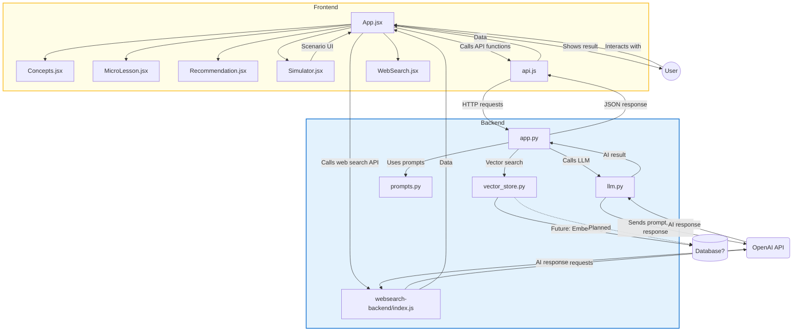

# AI Workplace Learning With AI



This project is a full-stack demo for the Nordic Software AI Hackathon. It features an AI-powered backend (FastAPI + OpenAI) and a modern React frontend for interactive workplace learning, simulation, and recommendations.

---

## Features

### Backend (FastAPI + Node.js)
- Modular API endpoints for:
  - AI Concepts generation
  - Micro-Lesson generation (with dynamic user input)
  - Scenario Simulation
  - AI Recommendation/Analysis
  - **Web Search (GPT-4.1 + tools, Node.js backend)** for up-to-date answers
- Dynamic prompt handling with user input (e.g., custom micro-lesson topics)
- Mocked AI responses if OpenAI API key is missing or invalid
- CORS enabled for frontend-backend communication

### Frontend (React)
- Modular, professional UI with each feature in its own card:
  - **Concepts** (`Concepts.jsx`)
  - **Micro-lesson** (`MicroLesson.jsx`)
  - **Recommendation** (`Recommendation.jsx`)
  - **Scenario Simulator** (`Simulator.jsx`)
  - **Web Search** (`WebSearch.jsx`)
- Tooltips/hints on all main options and inputs for user guidance
- Responsive, modern design with color-coded buttons
- **Per-section Clear buttons** for Concepts, Micro-lesson, and Recommendation to reset results and inputs
- Robust progress tracking and personalized dashboard
- Displays API results in a styled, readable format with proper text wrapping
- Ready for further expansion (user input for other endpoints, authentication, etc.)

---

## 4. Summary Table

| Endpoint         | Uses Web Search Tool? | Uses Standard LLM? |
|------------------|:--------------------:|:------------------:|
| `/concepts`      | ❌                   | ✅                 |
| `/micro-lesson`  | ❌                   | ✅                 |
| `/recommendation`| ❌                   | ✅                 |
| `/simulation`    | ❌                   | ✅                 |
| `/web-search`    | ✅                   | ✅ (with tool)     |

---

## Note: Two Backend Servers

This project uses **two backend servers**:

- **Python FastAPI backend** (main API):
  - Handles concepts, micro-lesson, recommendation, simulation, etc.
  - Run with:
    ```bash
    uvicorn backend.app:app --reload
    ```
- **Node.js Express backend** (web search):
  - Handles `/web-search` endpoint using OpenAI’s web search tool (if available)
  - Run with:
    ```bash
    cd websearch-backend
    node index.js
    ```

Your React frontend will call both as needed. This is a common pattern for hackathons and microservice architectures.

---

## Web Search Functionality: Tool Support and Fallback

The Web Search feature uses a separate Node.js backend to call OpenAI's GPT-4.1 model with the web search tool. **This tool is only available to some OpenAI users/organizations.**

- If your OpenAI account supports the web search tool (`web_search_preview`), you will get live, up-to-date answers from the internet.
- If not, the backend will **automatically fall back to a standard LLM response** (no web search, but still a high-quality answer).
- The user experience is seamless: you always get an answer, and no error is shown if web search is not available.

### Summary Table: Web Search Tool Support

| Tool Parameter         | Supported? | Fallback Behavior                |
|-----------------------|------------|----------------------------------|
| `web_search`          | ❌         | Falls back to standard LLM       |
| `web_search_preview`  | ❓ (beta)   | Falls back to standard LLM       |
| (no tools)            | ✅         | Standard LLM always works        |

- **Standard endpoints** (concepts, micro-lesson, recommendation, simulation) use the regular OpenAI API for fast, context-aware answers.
- **Web Search endpoint** uses GPT-4.1 with the web search tool if available, otherwise falls back to standard LLM.
- Both approaches work independently and do not interfere with each other.

---

## Tech Stack
- **Backend:** Python, FastAPI, OpenAI API, python-dotenv
- **Frontend:** React, JavaScript
- **Dev Tools:** Docker (planned), Google Cloud Run (planned)

---

## Project Structure

```
/backend/
  app.py
  prompts.py
  llm.py
  vector_store.py
/frontend/
  src/
    App.jsx
    Concepts.jsx
    MicroLesson.jsx
    Recommendation.jsx
    Simulator.jsx
    api.js
  package.json
/deployment/
  Dockerfile
  cloudrun.yaml
README.md
```

---

## Setup Instructions

### 1. Backend
- Install dependencies:
  ```bash
  pip install fastapi uvicorn openai python-dotenv
  ```
- (Optional) Add your OpenAI API key to a `.env` file:
  ```
  OPENAI_API_KEY=sk-...
  ```
- Start the backend:
  ```bash
  uvicorn backend.app:app --reload
  ```

### 2. Frontend
- In the `frontend` folder, install dependencies:
  ```bash
  npm install
  ```
- Start the React app:
  ```bash
  npm start
  ```
- Open [http://localhost:3000](http://localhost:3000) in your browser.

---

## Usage
- Click any button to call the backend API and display the result.
- For "Micro-Lesson", enter a topic and click the button for a custom lesson.
- Use the **Clear** button in each section to reset the input and result for that feature.
- Hover over any button or input for a helpful tooltip/hint.
- Progress is tracked and shown in the dashboard at the top.
- If no valid OpenAI key is set, you will see a mocked response.

---

## Next Steps
- Make the Scenario Simulator interactive (done!)
- Add user input for other endpoints
- Add authentication/user profiles
- Deploy to the cloud (Vercel, Google Cloud Run, etc.)
- Connect to a real OpenAI key for live AI responses (done!)

---

**Built for the Nordic Software AI Hackathon 2025** 