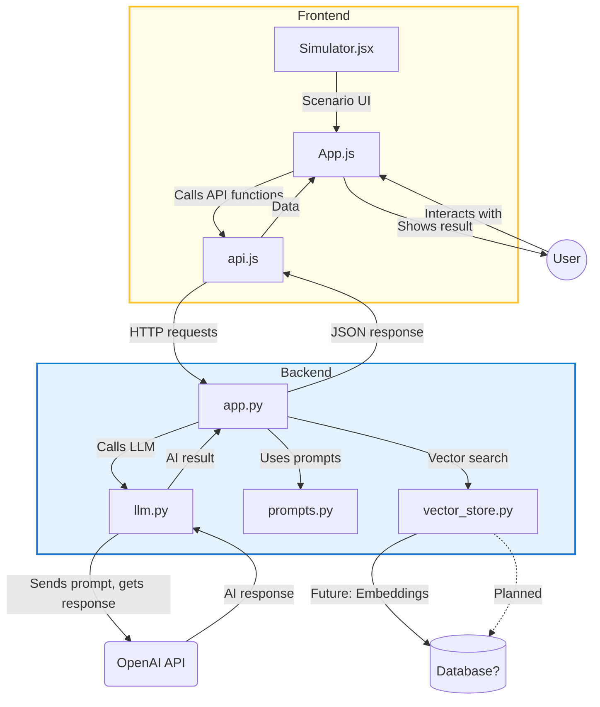

# AI Workplace Learning With AI



This project is a full-stack demo for the Nordic Software AI Hackathon. It features an AI-powered backend (FastAPI + OpenAI) and a modern React frontend for interactive workplace learning, simulation, and recommendations.

---

## Features

### Backend (FastAPI)
- Modular API endpoints for:
  - AI Concepts generation
  - Micro-Lesson generation (with dynamic user input)
  - Scenario Simulation
  - AI Recommendation/Analysis
- Dynamic prompt handling with user input (e.g., custom micro-lesson topics)
- Mocked AI responses if OpenAI API key is missing or invalid
- CORS enabled for frontend-backend communication

### Frontend (React + Material-UI)
- Professional, responsive UI with color-coded buttons and branding
- Dynamic user input for micro-lesson topics
- Clear/Reset functionality for input and results
- Displays API results in a styled, readable format
- Scenario Simulator placeholder for future interactivity
- Ready for further expansion (user input for other endpoints, authentication, etc.)

---

## Tech Stack
- **Backend:** Python, FastAPI, OpenAI API, python-dotenv
- **Frontend:** React, Material-UI (MUI), JavaScript
- **Dev Tools:** Docker (planned), Google Cloud Run (planned)

---

## Project Structure

```
/backend/
  app.py
  prompts.py
  llm.py
  vector_store.py
/frontend/
  src/
    App.js
    Simulator.jsx
    api.js
  package.json
/deployment/
  Dockerfile
  cloudrun.yaml
README.md
```

---

## Setup Instructions

### 1. Backend
- Install dependencies:
  ```bash
  pip install fastapi uvicorn openai python-dotenv
  ```
- (Optional) Add your OpenAI API key to a `.env` file:
  ```
  OPENAI_API_KEY=sk-...
  ```
- Start the backend:
  ```bash
  uvicorn backend.app:app --reload
  ```

### 2. Frontend
- In the `frontend` folder, install dependencies:
  ```bash
  npm install
  ```
- Start the React app:
  ```bash
  npm start
  ```
- Open [http://localhost:3000](http://localhost:3000) in your browser.

---

## Usage
- Click any button to call the backend API and display the result.
- For "Micro-Lesson", enter a topic and click the button for a custom lesson.
- Use the "Clear" button to reset the input and result.
- If no valid OpenAI key is set, you will see a mocked response.

---

## Next Steps
- Make the Scenario Simulator interactive
- Add user input for other endpoints
- Add authentication/user profiles
- Deploy to the cloud (Vercel, Google Cloud Run, etc.)
- Connect to a real OpenAI key for live AI responses

---

**Built for the Nordic Software AI Hackathon 2025** 